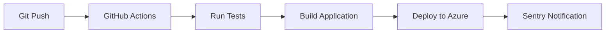

# AdmuseEasy - Full-Stack AI Marketing Platform

> 🚀 **Live Demo:** [https://admuse-easy.azurewebsites.net](https://admuse-easy.azurewebsites.net)  
> 📊 **Status:** Production-ready with CI/CD deployment  
> 💼 **Portfolio Project:** Showcasing full-stack development, DevOps, and QA practices

# AdmuseEasy

AdmuseEasy is a web application that allows users to manage and organize their creative projects. Built with modern web technologies, it provides an intuitive interface for project management and collaboration.

🚀 **Now deployed with Azure Web App for Containers!**

## 🎯 Project Highlights

- **Full-Stack Development:** React frontend + Node.js/Express backend
- **AI Integration:** Google Gemini API with intelligent prompt engineering
- **DevOps Pipeline:** GitHub Actions CI/CD with automated testing and deployment
- **Cloud Deployment:** Multi-platform hosting (Azure Web Apps + Railway)
- **Security-First:** JWT authentication, input validation, and security headers
- **Monitoring:** Sentry integration for error tracking and performance monitoring
- **Testing:** Comprehensive test suite with Cypress E2E and API testing

## ✨ Technical Features

### Core Features
- **AI-Powered Copy Generation** - Google Gemini integration with personality-driven prompts
- **4 Unique Mascot Personalities** - Each with distinct messaging styles
- **Responsive Design** - Works perfectly on desktop and mobile
- **Fallback System** - Reliable operation even without AI

### Business Features (NEW)
- **User Authentication** - Secure registration and login system
- **Project Management** - Save, edit, and organize your ad campaigns
- **Usage Analytics** - Track your generation history and statistics
- **User Dashboard** - Overview of projects and account activity
- **Cloud Database** - MongoDB integration for data persistence

## 🎭 Mascot Personalities

- **Cozy Capybara** - Calm, zen-like messaging for mindful brands
- **Hype Hamster** - Energetic, bold copy for dynamic products
- **Pixel Parrot** - Quirky, creative messaging for unique brands
- **Zen Panda** - Focused, balanced copy for professional services

## 🏗️ Architecture & DevOps

### CI/CD Pipeline


### Tech Stack
**Frontend:**
- ⚛️ React.js with modern hooks and functional components
- 🎨 Responsive CSS with mobile-first design
- 🔄 Component-based architecture with reusable UI elements
- 📱 Progressive Web App (PWA) ready

**Backend:**
- 🟢 Node.js with Express.js framework
- 🍃 MongoDB with Mongoose ODM
- 🔐 JWT authentication with bcryptjs encryption
- 🤖 Google Gemini AI integration
- 📧 Email integration for notifications

**DevOps & Infrastructure:**
- ☁️ Azure Web Apps deployment
- 🔄 GitHub Actions for CI/CD
- 🐳 Docker containerization ready
- 📊 Sentry for error monitoring and performance tracking
- 🧪 Automated testing with Cypress and Jest
- 🔒 Environment-based configuration management

**Security & Production:**
- bcryptjs password hashing
- Helmet.js security headers
- CORS protection
- Input validation and sanitization
- Environment variable protection

## 📋 Prerequisites

- Node.js (v18 or higher)
- MongoDB (local or cloud)
- Google Gemini API key (optional, has fallbacks)

## 🛠️ Installation

1. **Clone the repository:**
   ```bash
   git clone https://github.com/nuwnian/AdmuseEasy.git
   cd AdmuseEasy
   ```

2. **Install dependencies:**
   ```bash
   # Install root dependencies
   npm install
   
   # Install server dependencies
   cd server && npm install
   
   # Install client dependencies
   cd ../client && npm install
   ```

3. **Environment Setup:**
   ```bash
   # Copy environment template
   cp server/.env.example server/.env
   
   # Edit server/.env with your configuration:
   # MONGODB_URI=mongodb://localhost:27017/admuse-easy
   # JWT_SECRET=your-super-secret-jwt-key
   # GOOGLE_API_KEY=your-google-gemini-api-key (optional)
   ```

4. **Database Setup:**
   ```bash
   # Make sure MongoDB is running locally, or use MongoDB Atlas
   # The app will create the database automatically
   ```

5. **Start the application:**
   ```bash
   # Development mode (from root directory)
   npm start
   
   # Or start components separately:
   # Backend: cd server && npm start
   # Frontend: cd client && npm start
   ```

6. **Open your browser:**
   - Frontend: http://localhost:3000
   - API: http://localhost:5000/api/health

## � Development Journey & Problem Solving

This project showcases continuous learning and professional development practices:

### 🛠️ Technical Challenges Solved
- **File Path Resolution:** Debugged production deployment issues with client file serving
- **AI Fallback Systems:** Implemented robust error handling for API failures
- **Authentication Flow:** Built secure user registration and login system
- **Database Design:** Created efficient schemas for user projects and analytics
- **Performance Optimization:** Implemented caching and efficient data fetching

### 📈 DevOps & QA Implementation
- **GitHub Actions:** Set up automated testing and deployment pipeline
- **Error Monitoring:** Integrated Sentry for production error tracking and performance monitoring
- **Testing Strategy:** Implemented both unit tests and end-to-end testing with Cypress
- **Deployment Automation:** Multi-stage deployment with quality gates
- **Infrastructure as Code:** Documented and reproducible deployment processes

### 🎯 Business Understanding
- **User Experience:** Designed intuitive interface for non-technical marketers
- **Scalability Planning:** Built with growth and feature expansion in mind
- **Market Research:** Analyzed competitor platforms to identify improvement opportunities
- **Data Analytics:** Implemented user behavior tracking for product insights

## 📊 Live Application

🌐 **Production URL:** [https://admuse-easy.azurewebsites.net](https://admuse-easy.azurewebsites.net)

### Demo Features to Try:
1. **AI Ad Generation:** Create marketing copy with different mascot personalities
2. **User Registration:** Sign up and experience the full authentication flow
3. **Project Management:** Save and organize your ad campaigns
4. **Responsive Design:** Test on different screen sizes
5. **Dashboard Analytics:** View your usage statistics and project history

### Development Showcase:
- 👀 **Live GitHub Actions:** [View CI/CD Pipeline](https://github.com/nuwnian/AdmuseEasy/actions)
- 📊 **Error Monitoring:** Sentry integration for production stability
- 🧪 **Code Quality:** Explore best practices and comprehensive documentation
- 🔄 **Deployment Process:** Automated testing and quality gates

## 📚 API Documentation
- Authentication endpoints
- Project management
- User dashboard
- Ad generation
- Error handling

## 🧪 Testing

Test the API endpoints:
```bash
# Start the server first
npm start

# In another terminal, run API tests
cd server && node test-api.js
```

## 🌐 Live Deployments

- **Production (Azure):** https://admuse-easy.azurewebsites.net/
- **Staging (Railway):** https://admuseeasy-production.up.railway.app/

## 📁 Project Structure

```
AdmuseEasy/
├── client/                 # React frontend
│   ├── src/
│   │   ├── App.js         # Main application component
│   │   ├── QADocs.js      # QA documentation component
│   │   └── About.js       # About page component
│   └── public/            # Static assets
├── server/                # Node.js backend
│   ├── models/            # Database models
│   │   ├── User.js        # User model
│   │   └── Project.js     # Project model
│   ├── routes/            # API routes
│   │   ├── auth.js        # Authentication routes
│   │   ├── projects.js    # Project management routes
│   │   └── dashboard.js   # Dashboard routes
│   ├── middleware/        # Custom middleware
│   │   └── auth.js        # JWT authentication middleware
│   └── index.js           # Main server file
├── docs/                  # Documentation
└── API_DOCUMENTATION.md   # Complete API reference
```

## 🔒 Security Features

- JWT token-based authentication
- Password hashing with bcryptjs
- Input validation and sanitization
- CORS protection
- Security headers with Helmet.js
- Environment variable protection
- Rate limiting ready (configurable)

## 🚀 Deployment

### Azure App Service
1. Configure environment variables in Azure portal
2. Set up MongoDB Atlas or Azure Cosmos DB
3. Deploy using GitHub Actions (workflow included)

### Railway
1. Connect GitHub repository
2. Add environment variables
3. Deploy automatically on push

### Manual Deployment
```bash
# Build the application
npm run build

# Start in production mode
NODE_ENV=production npm start
```

## 🤝 Contributing

1. Fork the repository
2. Create a feature branch
3. Make your changes
4. Add tests if applicable
5. Submit a pull request

## 📄 License

This project is licensed under the MIT License - see the LICENSE file for details.

## 👨‍💻 About the Developer

**Information Systems Student | Full-Stack Developer | DevOps Enthusiast**

This project represents my journey in mastering modern web development practices. Built while learning full-stack development, it showcases:

- **Technical Growth:** From basic web development to production-ready applications
- **Problem-Solving:** Real-world debugging and deployment challenges
- **Learning Mindset:** Continuous improvement and adoption of best practices
- **Business Awareness:** Understanding user needs and market requirements

**Current Focus:** Expanding into Python/Django development and international project management practices.

**Portfolio:** [GitHub Profile](https://github.com/nuwnian) | [Live Project](https://admuse-easy.azurewebsites.net)

## 🎯 What's Next?

- Email verification system
- Password reset functionality
- Project sharing and collaboration
- Advanced analytics dashboard
- Export functionality (PDF, PNG)
- Team management features
- API rate limiting
- Webhook integrations

---

**Built with ❤️ for marketers, agencies, and entrepreneurs who want to create compelling ads without the complexity.**
# Workflow fix applied - 09/17/2025 19:23:46

